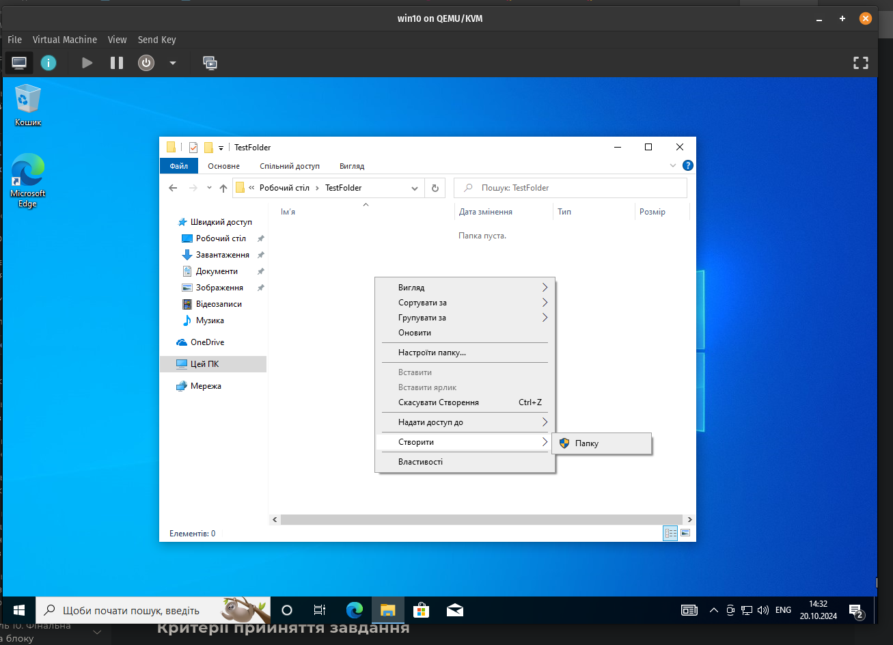
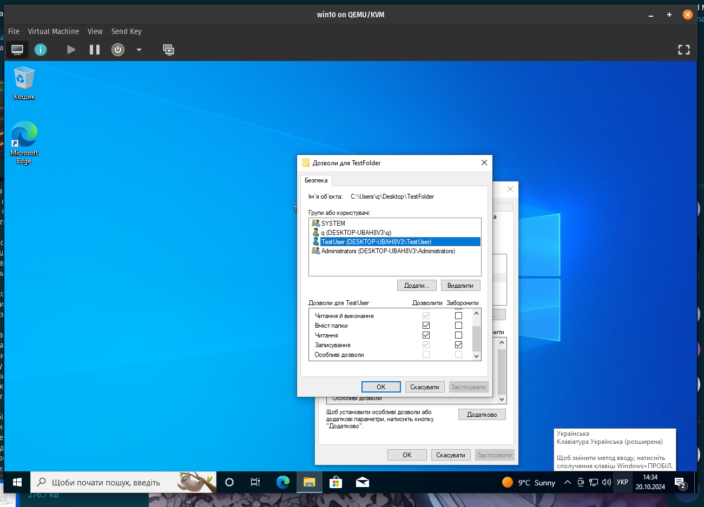
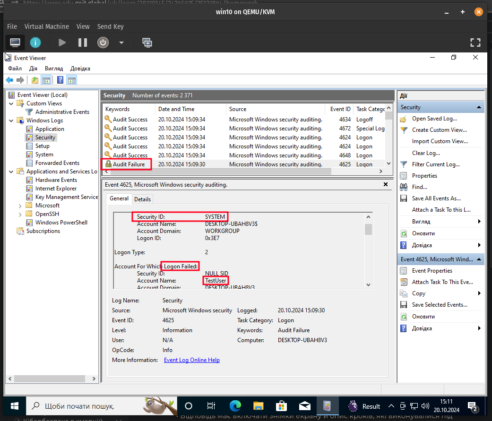
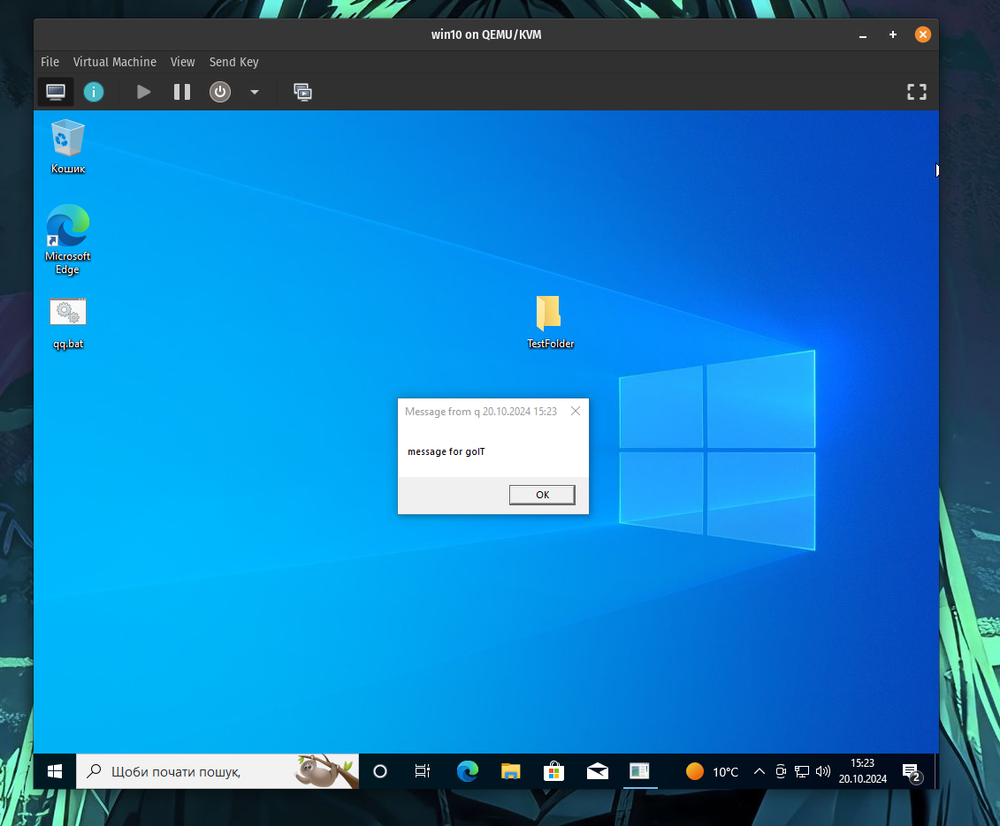
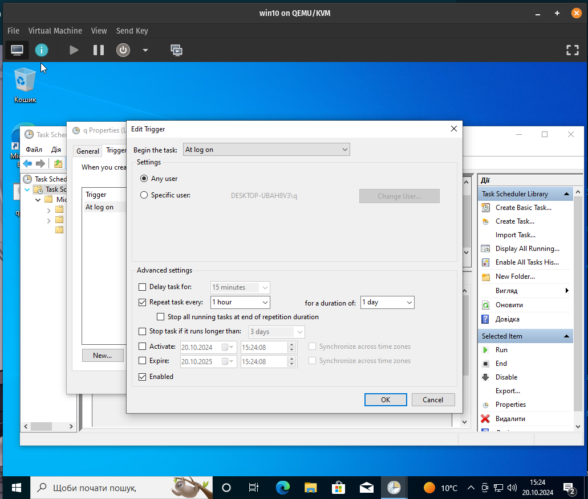
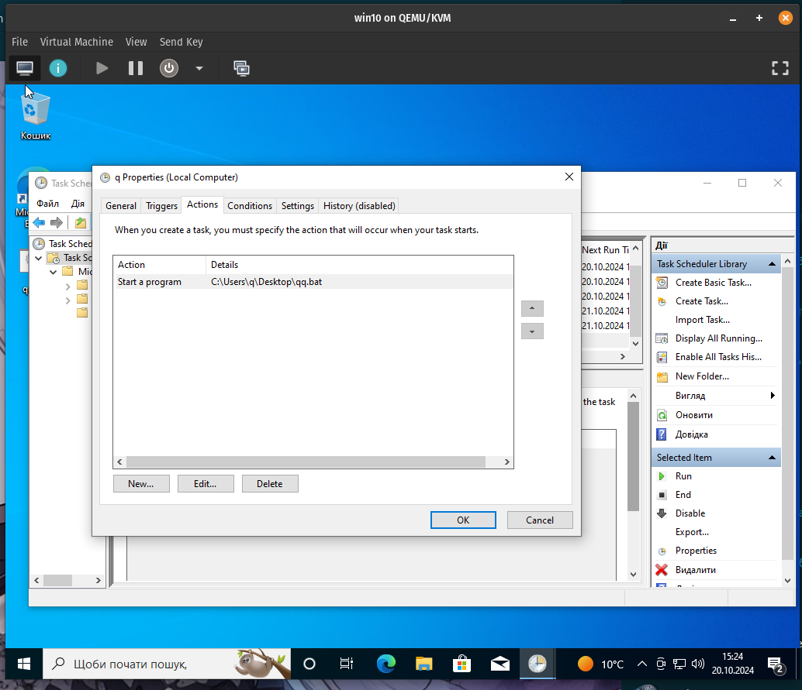
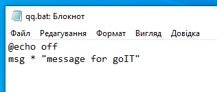

спочатку я створив користувача TestUser з паролем TestPassword123, використовуючи `compmgmt.msc`:

після цього, було завдання створити папку на робочому столі, та змінити права окремо для користувача TestUser, щоб було лише читання. я використав властивості папки, та перейшов в Безпека. добавивши користувача і змінивши права доступу, я виконав це завдання:

завдання зі зміною налаштувань логування івентів на неправильний пароль. це налаштування увімкнене по дефолту. тому, я просто переконався, що все працює. скріншот:

з останнім завданням виникли деякі труднощі, тому що була помилка 2147750704(deprecated). порившись трохи в answers.microsoft.com, я знайшов ось що:

тому я просто зробив .bat скрипт, який кожну годину запускається, та запускається після логіну користувача Q:

